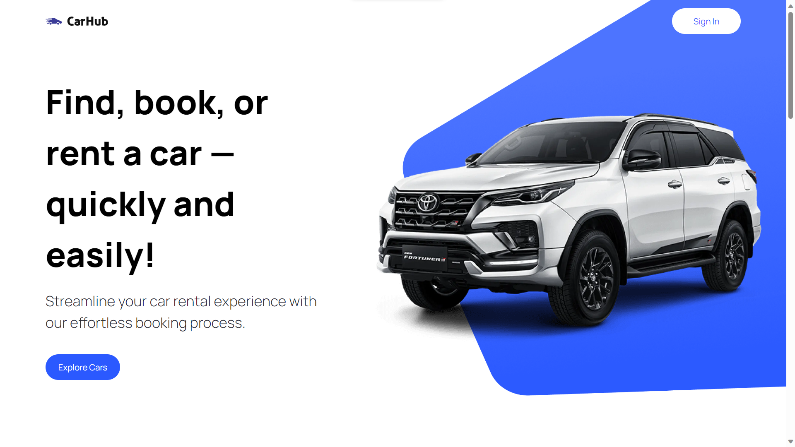
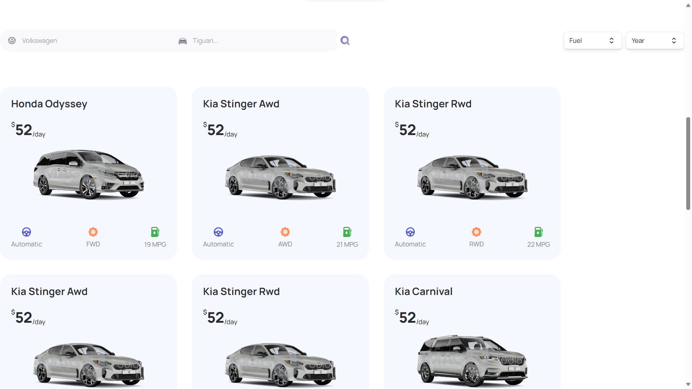

## Next.js 13 Car Showcase

### Home

### Search and Filter cars

### Dynamic Footer

I recently built a Next.js 13 application as a learning project that showcases a collection of cars. I used a variety of modern technologies, including:

- Next.js 13
- React
- TypeScript
- Tailwind CSS

By working on this project, I learned how to build and deploy modern web applications with Next.js 13. I also learned about the new features in Next.js 13, such as server components, incremental static regeneration, and middleware.

In addition to Next.js 13, I also learned about React, TypeScript, and Tailwind CSS. React is a popular JavaScript library for building user interfaces. TypeScript is a superset of JavaScript that adds type safety to your code. Tailwind CSS is a utility-first CSS framework that allows you to build custom components quickly and easily.

#### APIs Used

- **Car Data and Images**: I fetched car data and images from the [Imagin Studio Car Image API](https://www.imagin.studio/car-image-api).

- **Car Details**: For detailed car information, I used the [Cars by API Ninjas API](https://rapidapi.com/apininjas/api/cars-by-api-ninjas).

In addition to the above, I also learned about software development best practices and deployment. I learned how to write clean, maintainable, and scalable code. I also learned how to use version control systems such as Git and how to test my code. Finally, I learned how to deploy my web application to production.

## Learning Outcomes

- **Next.js 13:**
    - Learned how to build and deploy modern web applications with Next.js 13.
    - Learned about the new features in Next.js 13, such as server components, incremental static regeneration, and middleware.
- **React:**
    - Learned how to build user interfaces with React.
    - Learned about the React component model, state management, and props.
- **TypeScript:**
    - Learned how to use TypeScript to write type-safe code.
    - Learned about the benefits of using TypeScript, such as early error detection and improved code readability.
- **Tailwind CSS:**
    - Learned how to use Tailwind CSS to style my web applications.
    - Learned about the Tailwind CSS utility-first approach and how to build custom components with Tailwind CSS.
- **Software development best practices:**
    - Learned how to write clean, maintainable, and scalable code.
    - Learned how to use version control systems such as Git.
    - Learned how to test my code.
- **Deployment:**
    - Learned how to deploy my web application to production.
    - Learned about different hosting options and how to choose the right one for my needs.

## Conclusion

This project was a great learning experience for me. I learned a lot about Next.js 13, React, TypeScript, Tailwind CSS, and software development best practices. I also learned how to deploy web applications to production.

I am excited to share this project with others and hope that it can help them learn about these technologies as well.